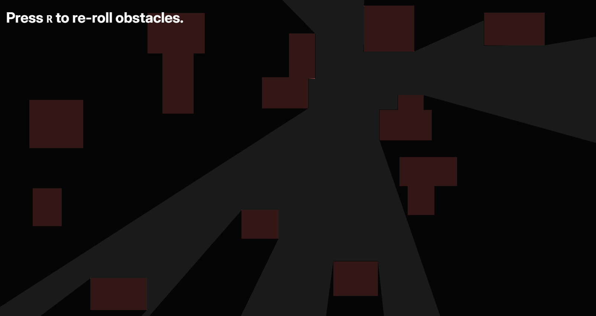

---
---

# Lighting



This page shows how to create dynamic lighting effects in Dreamlab using raycasting and PIXI graphics.

There is no built-in lighting system in Dreamlab. Instead, you can create lighting effects by combining raycasting for
line-of-sight calculations with PIXI graphics for rendering shadows and illuminated areas.

## Light Overlay Example

Here's an example implementation of a lighting system using the `LightOverlay` behavior, which creates a dynamic shadow
overlay that responds to the cursor position and world geometry.

```ts
import { Behavior, BehaviorDestroyed, Collider, RawPixi, value } from "@dreamlab/engine";
import * as PIXI from "@dreamlab/vendor/pixi.ts";
import { Ray } from "@dreamlab/vendor/rapier.ts";

export default class LightOverlay extends Behavior {
  @value()
  rays: number = 7200;

  @value()
  maxDistance: number = 100;

  #pixi = this.entity.cast(RawPixi);
  #overlay!: PIXI.Graphics;
  #mask!: PIXI.Graphics;

  #overlayCtx = new PIXI.GraphicsContext().rect(-100, -100, 200, 200).fill({ color: "black", alpha: 0.8 });

  onInitialize(): void {
    if (!this.game.isClient()) return;
    if (!this.#pixi.container) return;

    this.#mask = new PIXI.Graphics();
    this.#overlay = new PIXI.Graphics(this.#overlayCtx);
    this.#overlay.setMask({
      mask: this.#mask,
      inverse: true,
    });

    this.#pixi.container.addChild(this.#mask);
    this.#pixi.container.addChild(this.#overlay);

    this.on(BehaviorDestroyed, () => {
      this.#overlay?.destroy();
      this.#overlayCtx?.destroy();
      this.#mask?.destroy();
    });
  }

  onFrame(): void {
    if (!this.game.isClient()) return;
    this.#mask.clear();

    const { world } = this.game.inputs.cursor;
    if (!world) return;

    const colliders = this.game.entities.lookupByPosition(world).filter((entity) => entity instanceof Collider);

    if (colliders.length > 0) return;

    const rays = this.rays;
    const toi = this.maxDistance;
    const solid = true;

    this.#mask.moveTo(world.x, -world.y);
    for (let i = 0; i < rays + 1; i++) {
      const angle = (i / rays) * Math.PI * 2;
      const ray = new Ray(world, { x: Math.sin(angle), y: Math.cos(angle) });
      const hit = this.game.physics.world.castRay(ray, toi, solid);

      const impact = hit?.timeOfImpact ?? toi;
      const point = ray.pointAt(impact - 0.01);

      this.#mask.lineTo(point.x, -point.y);
    }

    this.#mask.lineTo(world.x, -world.y).fill("white");
  }
}
```

:::tip Try it yourself!

Want to test this lighting effect? Clone this example project and open it in the Dreamlab editor. Click here:
[Lighting Demo Project](https://app.dreamlab.gg/project/fork/u_kxz3lbxkp19woxvxzo3niwbz/lighting-demo)

:::

## How This Example Works

### Ray Casting for Visibility

This example casts rays in all directions from the cursor position:

1. **Ray Generation**: Creates rays in a 360-degree circle around the cursor
2. **Collision Detection**: Each ray is cast until it hits a solid collider or reaches the maximum distance
3. **Shadow Calculation**: The intersection points define the boundaries of the lit area

### Masking System

This implementation uses PIXI's masking system:

- **Overlay**: A dark semi-transparent rectangle that covers the entire screen
- **Mask**: A white polygon shape that defines the lit area based on raycasting
- **Inverse Masking**: The overlay is rendered everywhere except where the mask is present

### Example Properties

- `rays`: Number of rays to cast (higher values = smoother lighting, lower performance)
- `maxDistance`: Maximum distance rays can travel before being stopped
- `overlayCtx`: Graphics context defining the shadow overlay appearance

## Building Your Own Lighting

### Basic Concepts

- **Raycasting**: Use `Ray` from Rapier physics engine for line-of-sight calculations
- **PIXI Graphics**: Create visual effects with masks, fills, and shapes
- **Performance**: Balance ray count and update frequency for smooth gameplay

### Common Patterns

```ts
// Cast a single ray to check visibility
const ray = new Ray(lightPosition, direction);
const hit = this.game.physics.world.castRay(ray, maxDistance, solid);

// Create a mask for lighting effects
const mask = new PIXI.Graphics();
mask.circle(x, y, radius).fill("white");
someSprite.mask = mask;
```

## Integration with Physics

Lighting effects can integrate with Dreamlab's physics system:

- Uses `Ray` from the Rapier physics engine for collision detection
- Respects all solid colliders in the scene
- Can be combined with dynamic obstacles for moving shadows
