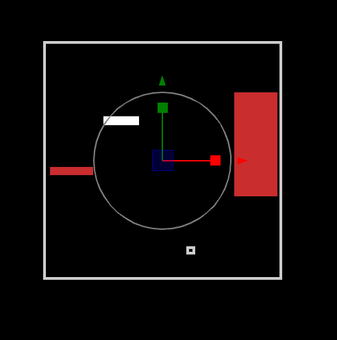

# Camera

:::info **This page is coming very soon!**

New version will be published by January 31st. If you need help sooner please ping us on Discord.

In the meantime, check out the [tutorial video](../quick-start.md#video-tutorial), which explains many of these
concepts. :::

When you select the camera you'll see a box representing the bounds. Things enclosed in this box are guaranteed to be
visible regardless of screen aspect ratio when the game is running.
