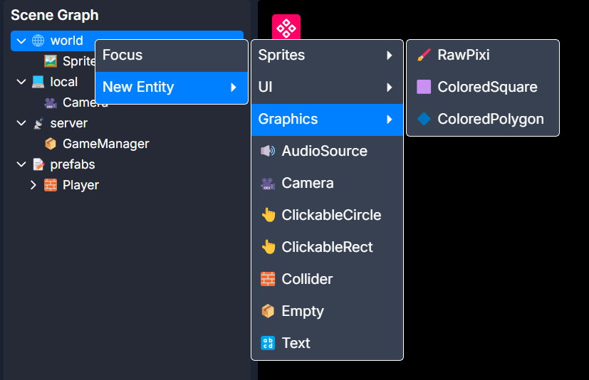

# Entities

Entities are the building blocks of games. They are similar to Unity's `GameObject` or Godot's `Node`. They implement basic functionality, support nesting and hierarchy, and can be scripted using Behavior classes.

Entities can be spawned using the right-click menu in the Scene Graph:

This page contains a list of every entity and what it's for.

## Sprites

Rendering images to the world

### AnimatedSprite
Takes a JSON spritesheet definition and can play an animation with configurable speed and frame range.  
See [Platformer with Animations](../examples/platformer-with-animations.mdx) example to see this in action.

### Sprite

### TilingSprite

## UI

Creating UI elements using HTML and CSS

### UIPanel

### UILayer

## Graphics

Rendering primitives

### RawPixi

### ColoredSquare

### ColoredPolygon

