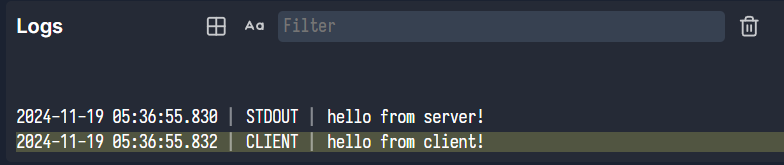

# Logging

When you use `console.log()`, logs will be captured on both the client and server and displayed in the UI.

For example, this code in a behavior:

```ts
if (this.game.isServer()) {
  console.log("hello from server!");
}
if (this.game.isClient()) {
  console.log("hello from client!");
}
```

will result in logs being displayed like this:



On the server, all logging is captured from STDOUT and STDERR and forwarded to the client. On the client, only
`console.log` is captured. If you want to print to your standard browser console instead, you can use `console.info` or
any other console methods to bypass the log capturing and get regular debug output.
