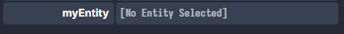
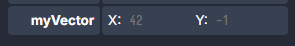

# Synced Values and Adapters

In a Behavior class, you can define properties with the @syncedValue decorator:

```typescript
import { Behavior, syncedValue } from "@dreamlab/engine";

export default class MyBehavior extends Behavior {
  @syncedValue() myNumber = 10;
  @syncedValue() myBoolean = false;
  @syncedValue() myString = "test"; // default values
}
```

This will cause the class property to be visible in the inspector when the Behavior is attached to an entity:


The changes made in the inspector will apply to the class instance and any syncedValue will also be replicated over the
network.

## Adapters

Adapters allow you to use more complex types with syncedValues. By default, Dreamlab only supports primitive types
(number, string, boolean) in synced values.

### EntityRef

Refer to a specific entity in the world.

```typescript
import { EntityRef, Entity } from "@dreamlab/engine";

@syncedValue(EntityRef) myEntity: Entity | undefined;
```

This will create a property which you can drag an entity into from the scene. 

### RelativeEntity

```typescript
import { RelativeEntity, Entity } from "@dreamlab/engine";

@syncedValue(RelativeEntity) myEntity: Entity | undefined;
```

Refer to an entity relative to this one. This is useful if you want to refer to a child of the entity. If the entity is
copied, the RelativeEntity values will point to the new children and not the original entity. It works the same as
`EntityRef` in the editor, simply drag an entity in to associate it.

### Vector2Adapter

```typescript
import { Vector2Adapter, Vector2 } from "@dreamlab/engine";
@syncedValue(Vector2Adapter) myVector = new Vector2(42, -1)
```

This will create a property that shows the vector components:  

