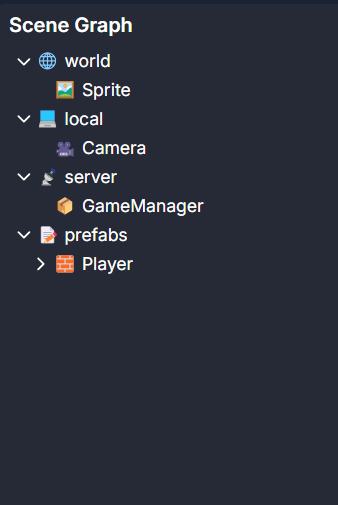

# The Four Trees

Dreamlab has a scene hierarchy like most other game engines. However, it's divided into four sections:

- world
  - Entities and Behavior scripts under the world tree will be synced to all clients. Their positions, rotations, etc.
    all automatically sync.
- local
  - Only spawn on each player's client. The main Camera lives here and is also a good place to put HUD or other
    client-only components
- server
  - Behaviors and Scripts only spawn and tick on the server. Useful for game state managers you only need to spawn once
    over the lifetime of the entire game.
- prefabs
  - These entities are disabled at runtime but can be copied into other world roots via `cloneInto` in scripts or can be
    copy-pasted using the editor. Useful for reusable objects.

For example, consider the following scene:

In this example, "Sprite" would exist on all clients. "Camera" only exists on each client. "GameManager" is only spawned
once and on the server. "Player" is a prefab that we can copy into the "world" tree when we need to spawn a player.
