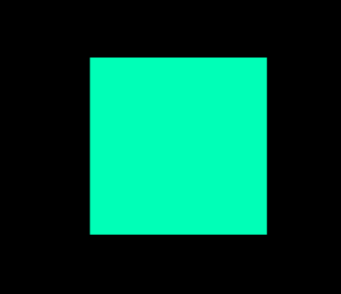

# Rendering with Pixi

This page shows how to render 2D shapes in Dreamlab using the Pixi API.

Pixi v8’s Graphics uses a chainable builder style (e.g. `.rect().fill().stroke()`), supports gradients/textures, SVG
paths, and has great performance.

## Getting Started: RawPixi and Graphics objects

Try attaching this below script to any entity. This will draw a blue box that tracks the position of the entity.

```ts
import { Behavior, RawPixi } from "@dreamlab/engine";
import * as PIXI from "@dreamlab/vendor/pixi.ts";

export default class GraphicsDemo extends Behavior {
  rawPixi!: RawPixi;
  g!: PIXI.Graphics;

  onInitialize() {
    if (!this.game.isClient()) return;
    this.rawPixi = this.game.local.spawn({
      type: RawPixi,
      name: "GraphicsTest",
      transform: { position: this.entity.pos, z: 5 },
    });

    // Create a PIXI.Graphics and add it to the RawPixi container
    this.g = new PIXI.Graphics();
    this.rawPixi!.container!.addChild(this.g);

    // 3) Draw something simple
    this.g.rect(0, 0, 5, 5).fill("#00ffb7");
  }

  onPostTick() {
    if (!this.game.isClient()) return;
    // Keep your graphics positioned relative to your entity
    this.rawPixi.globalTransform.position.x = this.entity.pos.x;
    this.rawPixi.globalTransform.position.y = this.entity.pos.y;
  }
}
```

You should see a teal square get rendered at your entity's position:



## Usage

### All the different shapes & features

#### 1) Fills (solid, gradient, texture)

**Solid color**

```ts
g.rect(0, 0, 200, 20).fill("#3ed36f");
```

**Gradient fill** (v8 `FillGradient`):

```ts
import * as PIXI from "@dreamlab/vendor/pixi.ts";

const grad = new PIXI.FillGradient(0, 0, 200, 0); // linear left→right
grad.addColorStop(0, "#3ed36f");
grad.addColorStop(1, "#e55039");

g.rect(0, 0, 200, 20).fill(grad);
```

Pixi v8 adds first-class gradient fills you can pass to `fill()`. ([Pixi docs][2])

**Texture fill**

```ts
const tex = await PIXI.Assets.load("ui/stripe.png");
g.rect(0, 0, 200, 20).texture(tex).fill(); // apply texture, then fill
```

`Graphics.texture()` lets you paint textures onto shapes before calling `fill()`. See the API for details. ([Pixi
docs][3])

#### Strokes (outlines)

```ts
g.roundRect(0, 0, 120, 16, 4).stroke({
  color: "#2f3342",
  width: 1,
  alignment: 0.5, // 0=inside, 0.5=center, 1=outside (see notes below)
  cap: "round",
  join: "round",
  miterLimit: 2,
});
```

Stroke properties in v8 are passed as a `StrokeStyle`/`StrokeAttributes` object (width, alignment, cap, join,
miterLimit, etc.). ([Pixi docs][4])

#### Paths, curves, arcs

```ts
g.moveTo(10, 10)
  .quadraticCurveTo(60, -20, 110, 10) // control (60,-20) → end (110,10)
  .stroke({ width: 2 });

g.arc(80, 80, 24, 0, Math.PI * 1.5).stroke({ width: 2 });
```

Curves (`quadraticCurveTo`, Bezier) and arcs are part of the v8 `Graphics`/`GraphicsContext` API. ([Pixi docs][3])

#### Advanced shapes

```ts
g.regularPoly(200, 60, 24, 6) // hexagon
  .fill("#55b6ff")
  .star(80, 160, 5, 24, 12) // 5-point star
  .fill("#ffd54d");
```

See the API for `regularPoly`, `roundPoly`, `star`, etc. ([Pixi docs][3])

#### “Cutting” holes

```ts
g.rect(0, 0, 100, 100).fill("#3ed36f").circle(50, 50, 20).cut(); // removes the circle from the previous fill
```

Use `.cut()` to punch a hole out of the previous shape (ensure the hole stays enclosed for correct triangulation).
([Pixi docs][1])

#### SVG path support

```ts
g.svg(`
  <svg>
    <path d="M 100 350 q 150 -300 300 0" stroke="blue" />
  </svg>
`);
```

You can parse simple SVG path data into graphics; it’s great for icons and decorative lines. ([Pixi docs][1])

#### Masks & hit areas

Any `Graphics` object can be used as a **mask** or **hit area**:

```ts
const mask = new PIXI.Graphics().circle(0, 0, 32).fill(0xffffff);
this.rawPixi.container.mask = mask;
```

This is a common pattern for clipping UI/art. ([Pixi docs][7])

---

### Performance tips (v8)

- **Build, don’t rebuild.** Avoid clearing and reconstructing complex geometry every frame. Prefer swapping prebuilt
  `GraphicsContext`s (`graphic.context = nextContext`) when animating. ([Pixi docs][1])
- **Reuse contexts.** Multiple `Graphics` can share one `GraphicsContext` (great for repeated shapes). Destroying a
  shared context will destroy all dependents, so manage lifetime carefully. ([Pixi docs][1])
- **Batching:** Many simple `Graphics` often batch better than one mega-shape. ([Pixi docs][1])

```ts
const barCtx = new PIXI.GraphicsContext().rect(0, 0, 64, 8).fill("#1e1f26");
const outlineCtx = new PIXI.GraphicsContext().roundRect(0, 0, 64, 8, 3).stroke({ color: "#2f3342", width: 1 });

const barA = new PIXI.Graphics(barCtx);
const barB = new PIXI.Graphics(barCtx); // cheap reuse
```

---

### Quick reference

- **Shapes:** `.rect`, `.roundRect`, `.circle`, `.ellipse`, `.arc`, `.moveTo/.lineTo`, `.quadraticCurveTo`,
  `.regularPoly`, `.roundPoly`, `.star` ([Pixi docs][3])
- **Fills:** `.fill(color|FillGradient|pattern)`, `.texture(texture)` (then `.fill()`) ([Pixi docs][2])
- **Strokes:** `.stroke({ width, color, alignment, cap, join, miterLimit, ... })` ([Pixi docs][4])
- **Holes:** `.cut()` (applies to the previous shape) ([Pixi docs][1])
- **SVG:** `.svg("<svg>…</svg>")` ([Pixi docs][1])
- **Context reuse:** `new GraphicsContext(...)` and pass it to `new Graphics(context)`; swap via
  `graphic.context = other` ([Pixi docs][1])

---

### Further reading

- **Graphics (v8 guide):** overview, shapes, SVG, holes, performance, gotchas. ([Pixi docs][1])
- **Graphics API (v8):** full method list (`fill`, `stroke`, `regularPoly`, `star`, `texture`, transforms, etc.). ([Pixi
  docs][3])
- **Fills (guide):** colors, textures, gradients (`FillGradient`, stops). ([Pixi docs][2])

[1]: https://pixijs.com/8.x/guides/components/scene-objects/graphics "Graphics | PixiJS"
[2]: https://pixijs.com/8.x/guides/components/scene-objects/graphics/graphics-fill "Graphics Fill"
[3]: https://pixijs.download/v8.2.3/docs/scene.Graphics.html "
      PixiJS API Documentation
    "
[4]: https://pixijs.download/v8.4.0/docs/scene.StrokeAttributes.html "StrokeAttributes"
[5]: https://github.com/pixijs/pixijs/issues/10950 "Hit test on strokes doesn't honor `alignment` StrokeStyle ..."
[6]: https://pixijs.com/8.x/guides/components/scene-objects/graphics/graphics-pixel-line "Graphics Pixel Line"
[7]: https://pixijs.download/v8.1.7/docs/scene.Graphics.html "Graphics"
