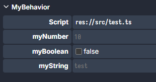

# Synced Values & Adapters

`@syncedValue()` turns a field into …

- a network-replicated variable
- an observable you can `onChanged()`
- a row in the Inspector (Properties Panel)

```ts
import { Behavior, value } from "@dreamlab/engine";

export default class MyBehavior extends Behavior {
  @syncedValue() myNumber = 10;
  @syncedValue() myBoolean = false;
  @syncedValue() myString = "test";
}
```

This will cause the class property to be visible in the inspector when the Behavior is attached to an entity:


The changes made in the inspector will apply to the class instance and any syncedValue will also be replicated over the
network.

## 1 · Listening for changes

```ts
this.values.get("myNumber")?.onChanged((next, prev) => {
  console.log(`+${next - prev} pts`);
});
```

## 2 · Built-in adapters

Adapters allow you to use more complex types with syncedValues. By default, Dreamlab only supports primitive types
(number, string, boolean) in synced values. Pass the adapter class as the first argument:

| Adapter class        | Purpose / UI                        | Usage example                                                |
| -------------------- | ----------------------------------- | ------------------------------------------------------------ |
| `EntityRef`          | Drag-drop any scene entity          | `@syncedValue(EntityRef) target?: Entity`                    |
| `RelativeEntity`     | Prefab-safe child/sibling reference | `@syncedValue(RelativeEntity) child?: Entity`                |
| `Vector2Adapter`     | Two number inputs (X & Y)           | `@syncedValue(Vector2Adapter) dir = new Vector2(1, 0)`       |
| `ColorAdapter`       | Hex picker                          | `@syncedValue(ColorAdapter) tint = "#ff00ffff"`              |
| `TextureAdapter`     | Texture path input + preview        | `@syncedValue(TextureAdapter) tex = "res://img.png"`         |
| `SpritesheetAdapter` | JSON spritesheet picker             | `@syncedValue(SpritesheetAdapter) sheet = "res://hero.json"` |
| `AudioAdapter`       | Audio asset picker                  | `@syncedValue(AudioAdapter) sfx = "res://hit.ogg"`           |
| `AspectRatioAdapter` | Two numbers (W x H)                 | `@syncedValue(AspectRatioAdapter) ratio = [16, 9]`           |
| `enumAdapter`        | Dropdown enum                       | See example below                                            |

### enumAdapter

`enumAdapter` allows you to specify a set of choices as valid values. This also conveniently as a drop down menu in the
editor. They are used like this:

```ts
// above the behavior class
const shapesAdapter = enumAdapter(["circle", "square", "triangle"]);
type Shape = enumAdapter.Union<typeof shapesAdapter>;

export default class Example extends Behavior {
  @syncedValue(shapesAdapter)
  foo: Shape = "circle";
}
```

## 3. Disabling replication

This is useful if you want to expose the value to the editor or other scripts without networking it. If you change it on
one client, the other clients or server don't get updated. For example:

```ts
@syncedValue(EntityRef, {replicated: false})
someEntity: Entity;
```

or with a number:

```ts
@syncedValue(Number as ValueTypeTag<number>, { replicated: false })
counter = 1;
```

### Alternative `@value` syntax

You might have noticed the gross `Number as ValueTypeTag<number>` syntax above. This is because `@syncedValue` forces us
to pass a type to access the overrides. If you want to override replicated on a primitive value, you can use `@value`
which has a slightly different method signature of `{type, ...overrides}`

For example:

```ts
@syncedValue(EntityRef, { replicated: false })
someEntity: Entity;

@syncedValue(Number as ValueTypeTag<number>, { replicated: false })
counter = 1;
```

becomes...

```ts
@value({ type: EntityRef, replicated: false })
someEntity: Entity;

@value({ replicated: false })
counter = 1;
```

The only difference between `@syncedValue` and `@value` is the arrangement of the arguments. `@value` allows you to set
overrides without specifying a type. **Both are valid** representations of the same thing.
